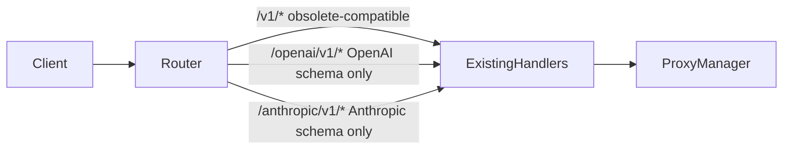

# Technical Specification: Split API Surfaces

## Document Info

**Status:** Draft
**Version:** 1.0
**Date:** 2026-05-16
**Target release:** TBD

## 1. Overview

### 1.1 Purpose

This spec defines explicit OpenAI-compatible and Anthropic-compatible API surfaces for llama-swap while preserving existing shared routes as obsolete compatibility paths.

### 1.2 Background

llama-swap supports many OpenAI-compatible endpoints and Anthropic-compatible `/v1/messages` endpoints. Some clients configure providers by base URL, and shared `/v1` paths can be confusing even when technically correct. New integrations should use canonical provider-specific base paths while existing `/v1` integrations continue to work.

### 1.3 Goals

| Goal | Success Metric | Target |
| ---- | -------------- | ------ |
| Backward compatibility | Existing route tests pass unchanged | 100% |
| Clarity | UI displays canonical provider base URLs | Both API families |
| Low risk | Split paths reuse existing handlers | No duplicate handler logic |
| Schema correctness | Provider-prefixed routes expose only matching schemas | No cross-provider aliases |

### 1.4 Non-Goals

- Remove obsolete shared `/v1` routes.
- Implement cross-provider request translation.
- Add provider-specific auth policy.
- Add cross-provider aliases such as `/openai/v1/messages` or `/anthropic/v1/chat/completions`.

## 2. Functional Requirements

### 2.1 Actors

| Actor | Description |
| ----- | ----------- |
| API client user | Configures a client with provider-specific base URLs. |
| Maintainer | Maintains route compatibility and documentation. |

### 2.2 User Flows

**Flow: Configure Anthropic Client**

1. User opens UI or docs.
2. User copies Anthropic-compatible base URL.
3. Client sends request to split Anthropic route.
4. llama-swap routes the request through existing Anthropic-compatible handling.

### 2.3 Functional Requirements

#### FR-001: OpenAI Canonical Route Surface

**Priority:** Should-have
**Actor:** API client user
**Description:** The system should support `/openai/v1/...` as the canonical base path for OpenAI-compatible endpoints.
**Acceptance criteria:**

- [x] `/openai/v1/chat/completions` behaves like `/v1/chat/completions`.
- [x] `/openai/v1/models` behaves like `/v1/models`.
- [x] `/openai/v1/messages` is not registered and uses default server behavior for unimplemented endpoints.
- [x] Existing auth behavior is unchanged.

#### FR-002: Anthropic Canonical Route Surface

**Priority:** Should-have
**Actor:** API client user
**Description:** The system should support `/anthropic/v1/...` as the canonical base path for Anthropic-compatible endpoints.
**Acceptance criteria:**

- [x] `/anthropic/v1/messages` behaves like `/v1/messages`.
- [x] `/anthropic/v1/messages/count_tokens` behaves like `/v1/messages/count_tokens`.
- [x] `/anthropic/v1/chat/completions` is not registered and uses default server behavior for unimplemented endpoints.
- [x] Existing auth behavior is unchanged.

#### FR-003: Existing Route Preservation

**Priority:** Must-have
**Actor:** Existing user
**Description:** The system shall preserve all existing shared `/v1` route behavior as obsolete-compatible behavior.
**Acceptance criteria:**

- [x] Existing endpoint tests pass without changing expected paths.
- [x] Existing docs examples remain valid or are marked obsolete-compatible.
- [x] New docs and generated snippets prefer canonical provider paths.

## 3. Non-Functional Requirements

| Category | Requirement | Target | Priority |
| -------- | ----------- | ------ | -------- |
| Compatibility | No existing route regressions | 100% | High |
| Performance | Route alias overhead | Negligible | Medium |
| Maintainability | Handler duplication | None | High |
| Documentation | Provider route tables | Complete for supported endpoints and obsolete shared paths | High |

## 4. System Architecture

### 4.1 Architecture Overview

Canonical provider routes should be implemented as aliases that normalize provider-prefixed paths to existing internal routing. The proxy manager should not need separate business logic per prefix beyond endpoint-family identification.

### 4.2 Component Responsibilities

| Component | Technology | Responsibility |
| --------- | ---------- | -------------- |
| HTTP router | Go | Register obsolete shared paths and canonical provider paths |
| UI/integrations | Svelte | Display/copy static provider-specific URLs |
| Docs | Markdown | Explain canonical and obsolete-compatible paths |

### 4.3 Key Design Decisions

**Decision: Alias, not fork**

- Chosen: Canonical provider routes reuse existing handlers.
- Rationale: Avoids behavior drift and duplicate tests.
- Trade-off: Some route internals may need path normalization.

**Decision: Provider schema boundaries**

- Chosen: Canonical provider routes only expose endpoints that match that provider's request and response schema.
- Rationale: A provider-prefixed base URL should be safe to give to clients that expect that provider schema.
- Trade-off: A user cannot use `/anthropic/v1/chat/completions` as a cosmetic alias for an OpenAI-compatible request.

**Decision: Obsolete shared routes**

- Chosen: Existing shared `/v1` routes remain available but are documented as obsolete for new integrations.
- Rationale: Current users should not break, but docs should guide new setups to less ambiguous base URLs.
- Trade-off: The server continues carrying both route families.

## 5. API Design

### 5.1 New Endpoints

No new admin or metadata endpoints are required. The canonical surfaces are static proxy routes.

### 5.2 Canonical OpenAI-Compatible Endpoints

Register canonical aliases for:

- `/openai/v1/completions`
- `/openai/v1/chat/completions`
- `/openai/v1/responses`
- `/openai/v1/embeddings`
- `/openai/v1/models`
- `/openai/v1/audio/speech`
- `/openai/v1/audio/transcriptions`
- `/openai/v1/audio/voices`
- `/openai/v1/images/generations`
- `/openai/v1/images/edits`

Do not register OpenAI-prefixed aliases for Anthropic-compatible endpoints.

### 5.3 Canonical Anthropic-Compatible Endpoints

Register canonical aliases for:

- `/anthropic/v1/messages`
- `/anthropic/v1/messages/count_tokens`

Do not register Anthropic-prefixed aliases for OpenAI-compatible endpoints.

### 5.4 Obsolete-Compatible Shared Endpoints

Preserve existing shared routes for current users:

- `/v1/completions`
- `/v1/chat/completions`
- `/v1/responses`
- `/v1/embeddings`
- `/v1/models`
- `/v1/audio/speech`
- `/v1/audio/transcriptions`
- `/v1/audio/voices`
- `/v1/images/generations`
- `/v1/images/edits`
- `/v1/messages`
- `/v1/messages/count_tokens`

These routes should be described as obsolete-compatible in docs and UI copy. They are not removed or behaviorally changed in this work.

### 5.5 Path Normalization

Before proxying to an upstream model server, provider-prefixed canonical paths must be normalized to the existing upstream path. For example:

| Incoming path | Upstream path |
| ------------- | ------------- |
| `/openai/v1/chat/completions` | `/v1/chat/completions` |
| `/openai/v1/models` | `/v1/models` |
| `/anthropic/v1/messages` | `/v1/messages` |
| `/anthropic/v1/messages/count_tokens` | `/v1/messages/count_tokens` |

The request body, auth behavior, CORS behavior, metrics capture, and model selection behavior should otherwise match the obsolete-compatible `/v1` route.

## 6. Data Model

No persistent data model changes are required.

## 7. Security Considerations

- Canonical provider routes must use the same authentication and CORS behavior as obsolete-compatible shared routes.
- Error responses should not expose more path or config detail than existing handlers.
- Provider-prefixed paths outside the canonical route table should use the server's default behavior for unimplemented endpoints rather than translating between schemas.

## 8. Observability

| Signal | What to instrument | Tooling |
| ------ | ------------------ | ------- |
| Metrics | Requests by provider surface [assumed] | Existing metrics if available |
| Logs | Route normalization errors | Existing logger |

## 9. Testing Strategy

| Level | Scope | Tools | Coverage Target |
| ----- | ----- | ----- | --------------- |
| Unit | Path normalization | Go test | All canonical aliases |
| Integration | Obsolete-compatible and canonical route behavior | Go test | Main endpoint families |
| Integration | Unimplemented provider-prefixed routes | Go test | OpenAI and Anthropic mismatch examples |
| Docs | Endpoint examples | Manual review | All documented paths |

## 10. Implementation Plan

### Phase 1: Docs

- [x] Update docs with explicit base URLs.
- [x] Update integration snippets to use canonical static base URLs.

### Phase 2: Route Aliases

- [x] Register OpenAI-compatible canonical routes.
- [x] Register Anthropic-compatible canonical routes.
- [x] Add tests proving obsolete-compatible and canonical paths use equivalent behavior.
- [x] Add tests proving wrong-schema provider-prefixed routes are not registered and use default unimplemented endpoint behavior.

### Phase 3: UI

- [x] Display provider base URLs on dashboard.
- [x] Add copyable curl examples.

## 11. Decisions

| # | Decision | Status |
| - | -------- | ------ |
| 1 | Canonical OpenAI-compatible base path is `/openai/v1`. | Decided |
| 2 | Canonical Anthropic-compatible base path is `/anthropic/v1`. | Decided |
| 3 | Existing `/v1` routes remain enabled and are marked obsolete-compatible. | Decided |
| 4 | Canonical provider routes only expose endpoints matching that provider schema. | Decided |
